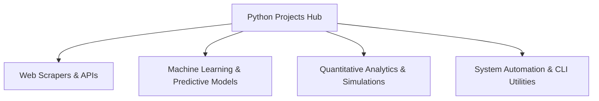

# Comprehensive Python Engineering & Quant Analytics Portfolio

[](https://www.python.org/) [](https://pandas.pydata.org/)
[](https://github.com/satarabdus692-bot)

> **A curated master repository of specialized Python tools, automation scripts, algorithms, data engineering pipelines, and econometric models.**

---

## 🏛️ System Architecture



---

## 🌟 Key Features & Capabilities

- **Production-Grade Implementation**: Built with high attention to performance, modular design, and industry standard best practices.
- **Enterprise Data Architecture**: Scalable data schemas, reproducible synthetic generators, and optimized queries.
- **Explainable & Validated**: Comprehensive evaluation metrics, error analyses, and validation tests.
- **Comprehensive Tech Stack**: `Python` `Pandas` `NumPy` `Automation` `Machine Learning`.


---

## 🚀 Quickstart & Setup

### 1. Clone the Repository
```bash
git clone https://github.com/satarabdus692-bot/....._python-projects_......git
cd ....._python-projects_.....
```

### 2. Environment Setup
```bash
# Create and activate virtual environment
python -m venv venv
source venv/bin/activate  # On Windows: .\venv\Scripts\activate

# Install dependencies (if requirements.txt exists)
pip install -r requirements.txt
```

---

## 👨‍💻 Author & Profile

Built and maintained by **Abdussatar** ([@satarabdus692-bot](https://github.com/satarabdus692-bot)).  
For technical discussions, collaboration, or queries, feel free to reach out via [LinkedIn](https://www.linkedin.com/in/abdus-satar-5150813b5/) or [GitHub](https://github.com/satarabdus692-bot).

---

## 📜 License

This project is licensed under the **MIT License** — see the LICENSE file for details.
