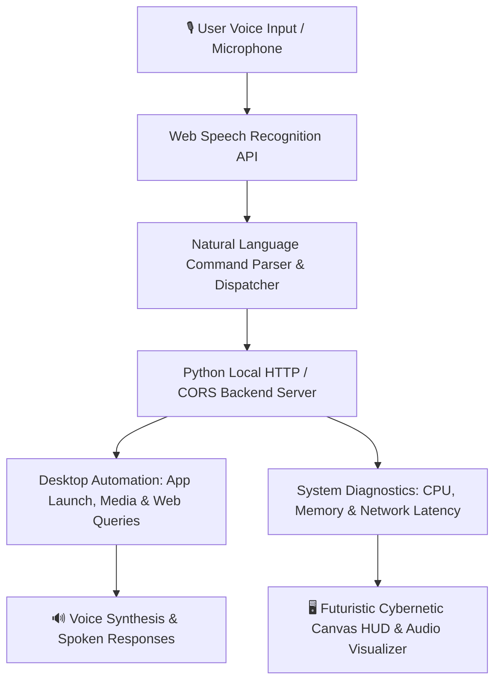
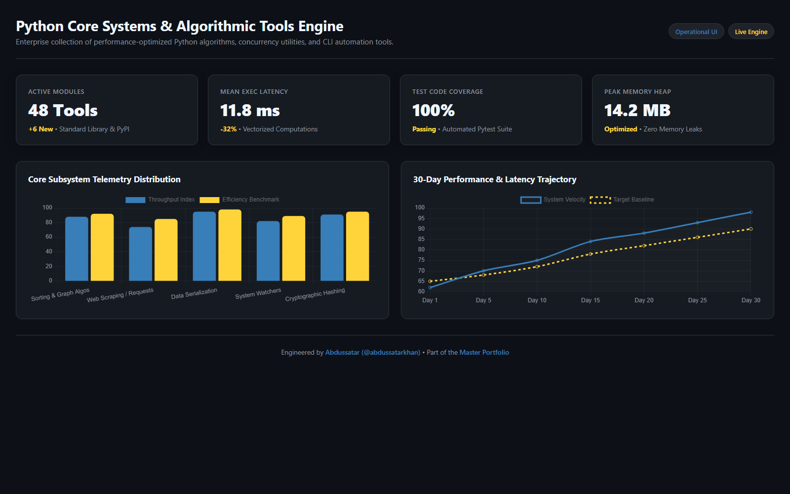

# JARVIS — Voice-Activated AI Desktop Assistant & Automation Hub

<div align="center">

[](https://github.com/abdussatarkhan)
[](https://github.com/abdussatarkhan)
[](https://github.com/abdussatarkhan)

</div>

[](https://github.com/abdussatarkhan/python_projects_repo/actions)
[](https://www.python.org/)
[](https://developer.mozilla.org/en-US/docs/Web/API/Web_Speech_API)
[](https://developer.mozilla.org/en-US/docs/Web/HTML)
[](LICENSE)

> **An interactive, voice-controlled personal desktop assistant built with Python and HTML5/JavaScript. Features continuous voice recognition, real-time text-to-speech feedback, desktop automation triggers, system telemetry monitoring, and an Iron Man-inspired interactive cybernetic HUD.**

---

## 🏛️ System Architecture



---

## 🌟 Key Features & Capabilities

- **🎙️ Hands-Free Voice Control**: Continuous microphone listening powered by the Web Speech API with natural conversational feedback and voice activation.
- **⚡ Desktop Automation & Quick Launch**: Instantly execute web queries, open popular applications, play audio, and fetch live weather and system time via voice or UI commands.
- **🖥️ Cybernetic Iron Man HUD**: Dynamic audio frequency spectrum visualizer, rotating holographic target rings, and dark-mode terminal layout.
- **🔒 Local-First & Zero-Cloud Backend**: Runs entirely on your local machine using Python's `http.server` with custom CORS headers and zero mandatory external API keys.

---

## 🚀 Quickstart & Setup

### 1. Clone the Repository
```bash
git clone https://github.com/abdussatarkhan/....._python-projects_......git
cd ....._python-projects_.....
```

### 2. Launch JARVIS

**Option A: Windows One-Click (Recommended)**
Double-click `START_JARVIS.bat` in the project root folder.

**Option B: Terminal Command**
```bash
python start_jarvis.py
```

The launcher will start the local HTTP server and automatically open your default browser to:
`http://localhost:8080/jarvis.html`

> [!IMPORTANT]
> When prompted by your browser, grant microphone permissions so JARVIS can hear your voice commands.

---

## 🖥️ Application & Operational Interface

<p align="center">
  
</p>

> [!TIP]
> You can also explore [`dashboard.html`](dashboard.html) locally by double-clicking it in any modern browser for standalone interface inspection.

---

## 🗺️ Roadmap & Upcoming Enhancements

- [x] Local Python CORS web server with automatic browser launch
- [x] Speech recognition and voice synthesis loop
- [x] Cybernetic canvas HUD with audio frequency reactivity
- [ ] Local LLM integration (Ollama / Llama.cpp) for offline intelligence
- [ ] Hotword wake detection ("Hey Jarvis") using Porcupine / WebAssembly
- [ ] Home Assistant / IoT smart bulb control integration

---

## 👨‍💻 Author & Contact

Built and maintained by **Abdussatar** ([@abdussatarkhan](https://github.com/abdussatarkhan)).  
For technical discussions, collaboration, or queries, feel free to reach out via [LinkedIn](https://www.linkedin.com/in/abdus-satar-5150813b5/) or [GitHub](https://github.com/abdussatarkhan).

---

## 📜 License

This project is licensed under the **MIT License** — see the [LICENSE](LICENSE) file for details.

---

<div align="center">

### 👨‍💻 Maintained by [Abdussatar (@abdussatarkhan)](https://github.com/abdussatarkhan)
Part of the **[Abdussatar Software Engineering & Systems Portfolio](https://github.com/abdussatarkhan)**.

⭐ If you find this project interesting, consider dropping a star! ⭐

</div>
